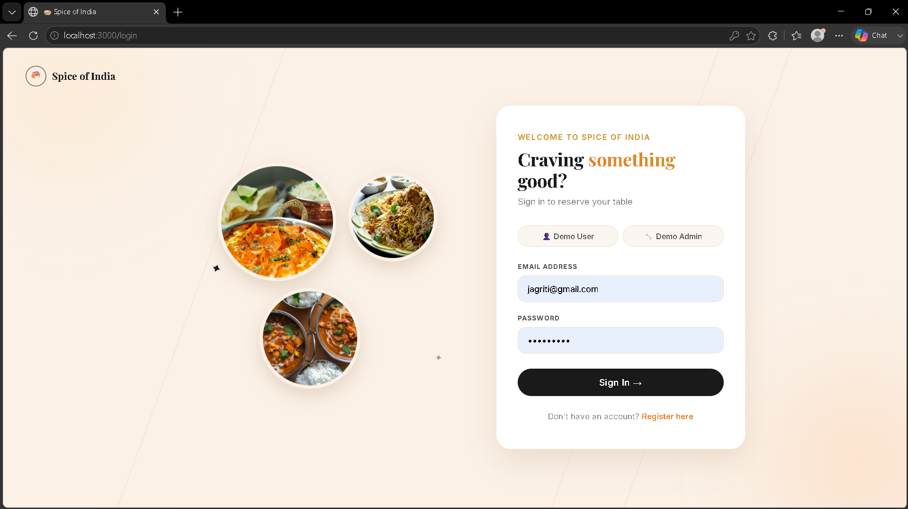
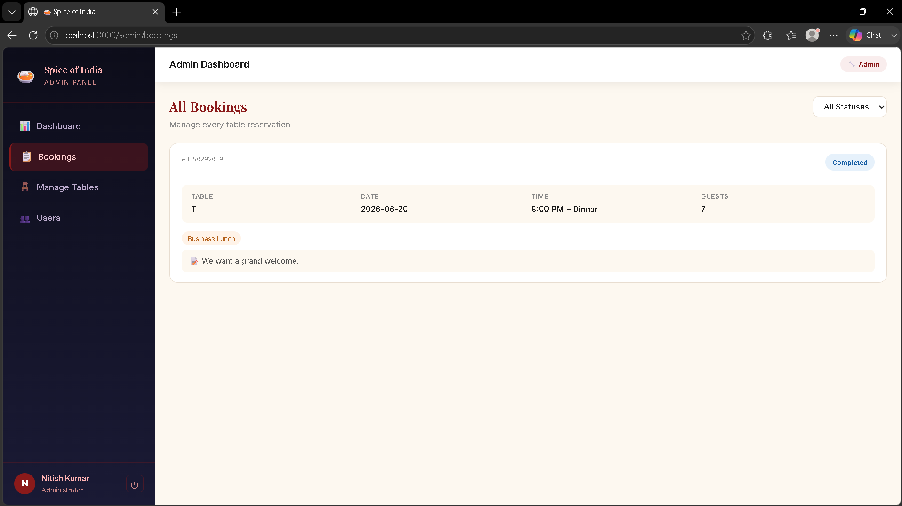

# 🍛 Spice of India - Restaurant Booking System

A full-stack **MERN** (MongoDB, Express, React, Node.js) restaurant table booking web application for **Spice of India** restaurant. Users can register, browse tables, make bookings, and manage their reservations. Admins can manage all bookings, tables, and users.

---

## 🌐 Live Demo

> Run locally at: `http://localhost:3000`

**Demo Credentials:**

| Role  | Email | Password |
|-------|-------|----------|
| Admin | nitish@spiceofindia.com | nitish123 |
| User  | jagriti@gmail.com | user123 |

---

## ✨ Features

### 👤 User
- Register & Login securely with JWT authentication
- Browse available restaurant tables
- Book a table by date, time, and number of guests
- View and manage personal bookings
- Update profile information

### 🔧 Admin
- View all bookings across all users
- Manage restaurant tables (add, edit, delete)
- View and manage all registered users
- Access admin dashboard with overview stats

---

## 🛠️ Tech Stack

| Layer | Technology |
|-------|-----------|
| Frontend | React.js, React Router, CSS Modules |
| Backend | Node.js, Express.js |
| Database | MongoDB Atlas (Mongoose) |
| Auth | JWT (JSON Web Tokens), bcryptjs |
| Notifications | React Hot Toast |

---

## 📁 Project Structure

```
restaurant-booking/
├── backend/
│   ├── config/
│   │   └── seed.js           # Database seeder
│   ├── controllers/
│   │   └── authController.js
│   ├── models/
│   │   ├── User.js
│   │   ├── Table.js
│   │   └── Booking.js
│   ├── routes/
│   ├── middleware/
│   ├── server.js
│   └── .env
├── frontend/
│   ├── public/
│   └── src/
│       ├── components/
│       ├── context/
│       │   └── AuthContext.js
│       ├── pages/
│       │   ├── auth/
│       │   │   ├── LoginPage.js
│       │   │   └── RegisterPage.js
│       │   ├── user/
│       │   │   ├── UserDashboard.js
│       │   │   ├── BookTable.js
│       │   │   ├── MyBookings.js
│       │   │   └── UserProfile.js
│       │   └── admin/
│       │       ├── AdminDashboard.js
│       │       ├── AdminBookings.js
│       │       ├── AdminTables.js
│       │       └── AdminUsers.js
│       └── App.js
└── README.md
```

---

## 🚀 Getting Started

### Prerequisites

Make sure you have the following installed:
- [Node.js](https://nodejs.org/) (v14 or higher)
- [npm](https://www.npmjs.com/)
- [MongoDB Atlas](https://www.mongodb.com/atlas) account

---

### 1. Clone the Repository

```bash
git clone https://github.com/your-username/restaurant-booking-mern.git
cd restaurant-booking-mern/restaurant-booking
```

---

### 2. Setup Backend

```bash
cd backend
npm install
```

Create a `.env` file in the `backend` folder:

```env
MONGO_URI=your_mongodb_connection_string
JWT_SECRET=your_jwt_secret_key
JWT_EXPIRE=7d
PORT=5000
```

---

### 3. Seed the Database

```bash
node config/seed.js
```

This will create:
- 1 Admin user
- 9 Sample users
- 12 Restaurant tables

---

### 4. Start Backend

```bash
npm start
```

You should see:
```
🚀 Server running on port 5000
✅ MongoDB Connected
```

---

### 5. Setup Frontend

Open a new terminal:

```bash
cd frontend
npm install
npm start
```

Frontend will open at: **http://localhost:3000**

---

## 👥 Sample Users

| Name | Email | Password | Role |
|------|-------|----------|------|
| Nitish Kumar | nitish@spiceofindia.com | nitish123 | Admin |
| Jagriti | jagriti@gmail.com | user123 | User |
| Deepak | deepak@gmail.com | user123 | User |
| Saurav | saurav@gmail.com | user123 | User |
| Sameer | sameer@gmail.com | user123 | User |
| Aryan | aryan@gmail.com | user123 | User |
| Ravi | ravi@gmail.com | user123 | User |
| Suraj | suraj@gmail.com | user123 | User |
| Shivang | shivang@gmail.com | user123 | User |
| Nicky | nicky@gmail.com | user123 | User |
---

## 🐛 Common Issues & Fixes

### Port already in use
```bash
netstat -ano | findstr :5000
taskkill /PID <PID_NUMBER> /F
```

### react-scripts not found
```bash
cd frontend
npm install
```

### Login failed / Invalid credentials
```bash
cd backend
node config/seed.js
```

## 📸 Screenshots

### 🔐 Login Page


### 🏠 Admin Dashboard


### 📅 Make Your Booking


### ✅ Confirm Reservation


### 📋 Manage Reservation


### 📋 Manage Reservation


---


## 🙏 Acknowledgements

- Built with ❤️ for **Spice of India** restaurant
- Authentic Indian Cuisine Since 2002
- MERN Stack Project

---

> Made by **Nitish Kumar** 
